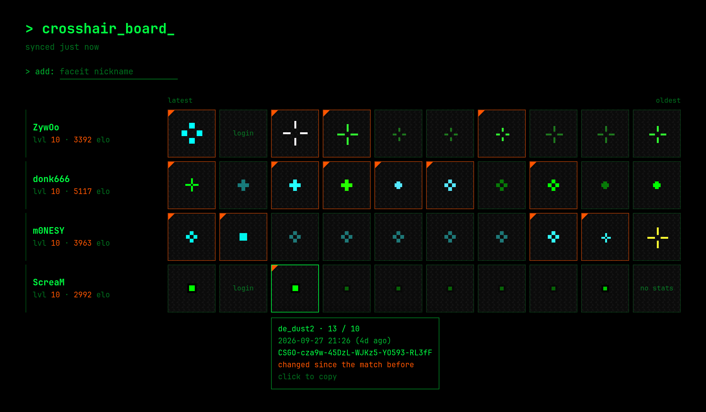

# FACEIT Crosshair Board

A Chrome extension that turns your new tab into a board of CS2 crosshairs: one row per
FACEIT player you pick, showing the crosshair they used in each of their last 10 matches.

- Click a crosshair to copy its share code.
- An orange corner marks a crosshair that changed since the match before.
- Add players on the new tab, or with the button on any FACEIT profile.

## Install

Download the zip from [Releases](https://github.com/lednifrolg/faceit-crosshair-board/releases),
unzip it, then in `chrome://extensions` turn on Developer mode and choose **Load unpacked**.

## Privacy

No account, no API key, no tracking. The extension only talks to www.faceit.com, and your
player list stays in your Chrome profile.

## Development

No build step. Load `src/` unpacked, run tests with `node --test`. See
[CONTRIBUTING.md](CONTRIBUTING.md).

Sibling project: [FACEIT Crosshair Peek](https://github.com/lednifrolg/faceit-crosshair-peek).

## License

GPL-3.0-or-later, see [LICENSE](LICENSE) and [THIRD-PARTY.md](THIRD-PARTY.md).
